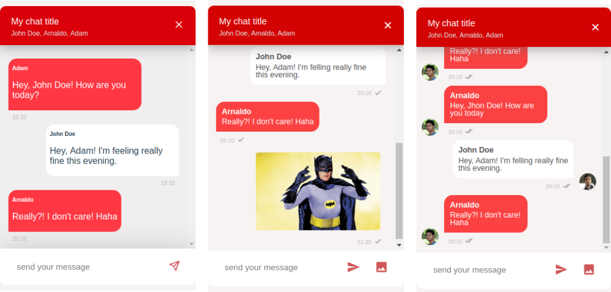

# vue-quick-chat
This vue component is a simple chat that can be easily imported and used in your project.

## Features
- Custom style
- Handle on type event and on message submit 
- Chat with multiple participants
- Support for async actions like message uploaded status
- Send images (released at version 1.1.0)
- Support for profile pictures (released at version 1.1.1)
- Uses Luxon in place of moment. Added event functions (released at version 1.2.0)
- Support for timestamp config (released at version 1.2.1)


## Instalation
```
yarn add vue-quick-chat
```
or with npm
```
npm install vue-quick-chat --save
```

## Usage
```javascript
import { Chat } from 'vue-quick-chat'
import 'vue-quick-chat/dist/vue-quick-chat.css';


export default {
  components: {
    Chat
  },
}
```
```html
<template>
  <div>
      <Chat v-if="visible"
        :participants="participants"
        :myself="myself"
        :messages="messages"
        :chat-title="chatTitle"
        :placeholder="placeholder"
        :colors="colors"
        :border-style="borderStyle"
        :hide-close-button="hideCloseButton"
        :close-button-icon-size="closeButtonIconSize"
        :submit-icon-size="submitIconSize"
        :submit-image-icon-size="submitImageIconSize"
        :load-more-messages="toLoad.length > 0 ? loadMoreMessages : null"
        :async-mode="asyncMode"
        :scroll-bottom="scrollBottom"
        :display-header="true"
        :send-images="true"
        :profile-picture-config="profilePictureConfig"
        :timestamp-config="timestampConfig"
        :link-options="linkOptions"
        :accept-image-types="'.png, .jpeg'"
        @onImageClicked="onImageClicked"
        @onImageSelected="onImageSelected"
        @onMessageSubmit="onMessageSubmit"
        @onType="onType"
        @onClose="onClose"/>
   </div>
</template>
```
You can also use a slot to define the header content
```html
<div>
	<Chat 
        :participants="participants"
        :myself="myself"
        :messages="messages"
        :chat-title="chatTitle"
        :placeholder="placeholder"
        :colors="colors"
        :border-style="borderStyle"
        :hide-close-button="hideCloseButton"
        :close-button-icon-size="closeButtonIconSize"
        :submit-icon-size="submitIconSize"
        :submit-image-icon-size="submitImageIconSize"
        :load-more-messages="toLoad.length > 0 ? loadMoreMessages : null"
        :link-options="linkOptions"
        :async-mode="asyncMode"
        :scroll-bottom="scrollBottom"
        :display-header="true"
        :send-images="true"
        :profile-picture-config="profilePictureConfig"
        :timestamp-config="timestampConfig"
        @onImageClicked="onImageClicked"
        @onImageSelected="onImageSelected"
        @onMessageSubmit="onMessageSubmit"
        @onType="onType"
        @onClose="onClose">
        <template v-slot:header>
          <div>
            <p v-for="(participant, index) in participants" :key="index" class="custom-title">{{participant.name}}</p>
          </div>
        </template>
        </Chat>
</div>
```
Bellow we have an example of the component data structure
```javascript
import {Chat} from 'vue-quick-chat';
import 'vue-quick-chat/dist/vue-quick-chat.css';

export default {
    components: {
        Chat
    },
    data() {
        return {
            visible: true,
            participants: [
                {
                    name: 'Arnaldo',
                    id: 1,
                    profilePicture: 'https://upload.wikimedia.org/wikipedia/en/thumb/a/a1/NafSadh_Profile.jpg/768px-NafSadh_Profile.jpg'
                },
                {
                    name: 'José',
                    id: 2,
                    profilePicture: 'https://lh3.googleusercontent.com/-G1d4-a7d_TY/AAAAAAAAAAI/AAAAAAAAAAA/AAKWJJPez_wX5UCJztzEUeCxOd7HBK7-jA.CMID/s83-c/photo.jpg'
                }
            ],
            myself: {
                name: 'Matheus S.',
                id: 3,
                profilePicture: 'https://lh3.googleusercontent.com/-G1d4-a7d_TY/AAAAAAAAAAI/AAAAAAAAAAA/AAKWJJPez_wX5UCJztzEUeCxOd7HBK7-jA.CMID/s83-c/photo.jpg'
            },
            messages: [
                {
                    content: 'received messages',
                    myself: false,
                    participantId: 1,
                    timestamp: {year: 2019, month: 3, day: 5, hour: 20, minute: 10, second: 3, millisecond: 123},
                    type: 'text'
                },
                {
                    content: 'sent messages',
                    myself: true,
                    participantId: 3,
                    timestamp: {year: 2019, month: 4, day: 5, hour: 19, minute: 10, second: 3, millisecond: 123},
                    type: 'text'
                },
                {
                    content: 'other received messages',
                    myself: false,
                    participantId: 2,
                    timestamp: {year: 2019, month: 5, day: 5, hour: 10, minute: 10, second: 3, millisecond: 123},
                    type: 'text'
                }
            ],
            chatTitle: 'My chat title',
            placeholder: 'send your message',
            colors: {
                header: {
                    bg: '#d30303',
                    text: '#fff'
                },
                message: {
                    myself: {
                        bg: '#fff',
                        text: '#bdb8b8'
                    },
                    others: {
                        bg: '#fb4141',
                        text: '#fff'
                    },
                    messagesDisplay: {
                        bg: '#f7f3f3'
                    }
                },
                submitIcon: '#b91010',
                submitImageIcon: '#b91010',
            },
            borderStyle: {
                topLeft: "10px",
                topRight: "10px",
                bottomLeft: "10px",
                bottomRight: "10px",
            },
            hideCloseButton: false,
            submitIconSize: 25,
            closeButtonIconSize: "20px",
            asyncMode: false,
            toLoad: [
                {
                    content: 'Hey, John Doe! How are you today?',
                    myself: false,
                    participantId: 2,
                    timestamp: {year: 2011, month: 3, day: 5, hour: 10, minute: 10, second: 3, millisecond: 123},
                    uploaded: true,
                    viewed: true,
                    type: 'text'
                },
                {
                    content: "Hey, Adam! I'm feeling really fine this evening.",
                    myself: true,
                    participantId: 3,
                    timestamp: {year: 2010, month: 0, day: 5, hour: 19, minute: 10, second: 3, millisecond: 123},
                    uploaded: true,
                    viewed: true,
                    type: 'text'
                },
            ],
            scrollBottom: {
                messageSent: true,
                messageReceived: false
            },
            displayHeader:true,
            profilePictureConfig: {
                others: true,
                myself: true,
                styles: {
                    width: '30px',
                    height: '30px',
                    borderRadius: '50%'
                }
            },
            timestampConfig: {   
                format: 'HH:mm',
                relative: false
            },
            // there are other options, you can check them here
            // https://soapbox.github.io/linkifyjs/docs/options.html
            linkOptions: {
                myself: {
                    className: 'myLinkClass',
                    events: {
                        click: function (e) {
                            alert('Link clicked!');
                        },
                        mouseover: function (e) {
                            alert('Link hovered!');
                        }
                    },
                    format: function (value, type) {
                        if (type === 'url' && value.length > 50) {
                            value = value.slice(0, 50) + '…';
                        }
                        return value;
                    }
                },
                others: {
                    className: 'othersLinkClass',
                    events: {
                        click: function (e) {
                            alert('Link clicked!');
                        },
                        mouseover: function (e) {
                            alert('Link hovered!');
                        }
                    },
                    format: function (value, type) {
                        if (type === 'url' && value.length > 50) {
                            value = value.slice(0, 50) + '…';
                        }
                        return value;
                    }
                }
            }
        }
    },
    methods: {
        onType: function (event) {
            //here you can set any behavior
        },
        loadMoreMessages(resolve) {
            setTimeout(() => {
                resolve(this.toLoad); //We end the loading state and add the messages
                //Make sure the loaded messages are also added to our local messages copy or they will be lost
                this.messages.unshift(...this.toLoad);
                this.toLoad = [];
            }, 1000);
        },
        onMessageSubmit: function (message) {
            /*
            * example simulating an upload callback. 
            * It's important to notice that even when your message wasn't send 
            * yet to the server you have to add the message into the array
            */
            this.messages.push(message);

            /*
            * you can update message state after the server response
            */
            // timeout simulating the request
            setTimeout(() => {
                message.uploaded = true
            }, 2000)
        },
        onClose() {
            this.visible = false;
        },
        onImageSelected(files, message){
            let src = 'https://149364066.v2.pressablecdn.com/wp-content/uploads/2017/03/vue.jpg'
            this.messages.push(message);
            /**
             * This timeout simulates a requisition that uploads the image file to the server.
             * It's up to you implement the request and deal with the response in order to
             * update the message status and the message URL
             */
            setTimeout((res) => {
                message.uploaded = true
                message.src = res.src
            }, 3000, {src});
        },
        onImageClicked(message){
            /**
             * This is the callback function that is going to be executed when some image is clicked.
             * You can add your code here to do whatever you need with the image clicked. A common situation is to display the image clicked in full screen.
             */
            console.log('Image clicked', message.src)
        }
    }
}
```
## Component Props
| name | type | required |default |description |
|------|------|----------|--------|------------|
| participants | Array | true |  | An array of participants. Each [participant](#participant) should be an Object with name and id|
| myself | Object | true |  | Object of my [participant](#participant). "myself" should be an Object with name and id|
| messages | Array | true |  | An array of [messages](#message). Each message should be an Object with content, myself, participantId and timestamp|
| chatTitle | String | false | Empty String | The title on chat header |
| placeholder | String | false | 'type your message here' | The placeholder of message text input |
| colors | Object | true |  | Object with the [color's](#color) description of style properties |
| borderStyle | Object | false | { topLeft: "10px", topRight: "10px", bottomLeft: "10px", bottomRight: "10px"}  | Object with the description of border style properties |
| hideCloseButton | Boolean | false | false  | If true, the 'Close' button will be hidden |
| submitIconSize | int | false | 24 | The submit icon size in pixels. |
| submitImageIconSize | int | false | 24 | The image submit icon size in pixels. |
| closeButtonIconSize | String | false | "15px" | The close button icon size in pixels. |
| asyncMode | Boolean | false | false | If the value is ```true``` the component begins to watch message upload status and displays a visual feedback for each message. If the value is ```false``` the visual feedback is disabled |
| loadMoreMessages | Function | false | () => false | If this function is passed and you reach the top of the messages, it will be called and a loading state will be displayed until you resolve it by calling the only parameter passed to it |
| scrollBottom | Object | false | { messageSent: true, messageReceived: false} | This object describes the chat scroll behavior. The two options represent the moment when the chat should scroll to the bottom. If 'messageSent' is ```true```, the chat will scroll to bottom aways you send a new message. If 'messageReceived' is ```true```, the chat will scroll to bottom always you receive a new message.  |
| displayHeader | Boolean | false | true | This prop describes whether the header should be displayed or not |
| profilePictureConfig | Object | false | ```{ others: true, myself: false, styles: { width: '25px', height: '25px', borderRadius: '50%'} }``` | This prop is a js Object that decribes the style and the behavoir of the chat regards to the users profile picture. |
| timestampConfig | Object | false | ```{ format: 'HH:mm', relative: false }``` | This prop is a js Object that decribes the timestamp format / relativeness. |
| linkOptions | Object | false | ```{ myself: {}, others: {} }``` | This prop is an Object that configures the links that may appear on the messages' content. ```myself``` defines the config for links in sent messages. ```others``` defines the config for links in received messages. This functionality relies on [linkifyjs](https://soapbox.github.io/linkifyjs/). You can find the full doc of this prop [here](https://soapbox.github.io/linkifyjs/docs/options.html). |
| acceptImageTypes | String | false | ```image/*``` | This prop defines the image types that are accepted to be uploaded. The image types should be separated by a comma (e.g. ```'.png, .jpeg, .jpg'```) |

# Events
| name | type | required |default |description |
|------|------|----------|--------|------------|
| onType | Function | false | () => false | Event called when the user is typing |
| onMessageSubmit | Function | false | () => false | Event called when the user sends a new message |
| onClose | Function | false | () => false | Event called when the user presses the close icon |
| onImageClicked | Function | false | () => false |  This prop is a callback function that is called after the user clicks on an image. This function may receive the message that represents the image clicked. You have many possibilities of implementations, one of them, is to display the clicked image on full-screen mode. |
| onImageSelected | Function | false | () => false | This prop is a callback function that is called after the user selects an image from the computer. This is the function that should upload the image to the server and update the message status to uploaded and the src to the uploaded image URL. |

### participant
| name | type | description |
|---------|--------|----------------|
| id | int | The user id should be an unique value |
| name | String | The user name that will be displayed |
| profilePicture | String | The user profule picture url |

Example
```javascript
{
  name:  'Username',
  id: 1,
  profilePicture: 'profile_url'
},
```
### message
| name | type | description |
|---------|--------|----------------|
| content | String | The message text content |
| myself | boolean | (REMOVED) Whether the message was sent by myself or by other participants. Since version 1.0.8 this property is automatically set by the chat |
| participantId | int | The participant's id who sent the message  |
| timestamp | Object| Object describing the year, month, day, hour, minute, second and millisecond that the message was sent |
| uploaded | Boolean| If asyncMode is ```true``` and uploaded is ```true```, a visual feedback is displayed bollow the message. If asyncMode is ```true``` and uploaded is ```false```, a visual loading feedback is displayed bollow the message. If asyncMode is ```false```, this property is ignored.|
| viewed | Boolean| If asyncMode is ```true``` and viewed is ```true```, a visual feedback is displayed bollow the message.|
| preview | String | (ONLY FOR IMAGES) This prop is automatically set by the chat. It represents the preview image URL while the image is being uploaded to the server. |
| src | String | (ONLY FOR IMAGES) This prop should be set by you after the image is uploaded. You should do it in the callback function onImageSelected. The prop represents the image URL of the uploaded image. |
| type | String | This prop should be set by you in case a new message is received, otherwise, the chat will automatically set this prop. |

Example
```javascript
{
  content: 'received messages', 
  //myself: false,
  participantId: 1,
  timestamp: { 
    year: 2019, 
    month: 3, 
    day: 5, 
    hour: 20, 
    minute: 10, 
    second: 3, 
    millisecond: 123 
  },
  uploaded: true,
  viewed: true,
  type: 'text' // or 'image'
  // generated by URL.createObjectURL(file)
  // (ONLY NEEDED FOR IMAGES)
  preview: 'blob:http://mydomain/11999c0j-4abc-4e56-acc7-fb0bbd616ea7',
  src: 'myurl.com/images/image.png',
}
```
### color
| name | type | description |
|---------|--------|----------------|
| header | Object | Object containing the header background and text color |
| message | Object | Object containing the message background and text color. The Object should contains the style for 'myself' and 'others' |
| messagesDisplay | Object | Object containing the background color of mesages container. |
| submitIcon | String | The color applied to the send message button icon |
| submitImageIcon | String | The color applied to the send image button icon |

Example
```javascript
{
  header:{
    bg: '#d30303',
    text: '#fff'
  },
  message:{
    myself: {
      bg: '#fff',
      text: '#bdb8b8'
    },
    others: {
      bg: '#fb4141',
      text: '#fff'
    }
  },
  messagesDisplay: {
    bg: '#f7f3f3'
  },
  submitIcon: '#b91010',
  submitImageIcon: '#b91010'
}

```
## profilePictureConfig
| name | type | description |
|---------|--------|----------------|
| others | Boolean | Whether the profile picture of the other participant should be displayed on the screen |
| myself | Boolean | Whether the profile picture of the current participant (myself) should be displayed on the screen |
| styles | Object | Object containing the description of the size and the shape of the profile images picture |

Example
``` javascript
profilePictureConfig: {
    others: true,
    myself: true,
    styles: {
        width: '30px',
        height: '30px',
        borderRadius: '50%'
    }
}
```
## timestampConfig
| name | type | description |
|---------|--------|----------------|
| format | String | [Timestamp format](https://moment.github.io/luxon/docs/manual/formatting.html#toformat) |
| relative | Boolean | Whether the timestamp should be relative to current time |

Example
``` javascript
timestampConfig: {   
    format: 'HH:mm',
    relative: false
}
```
## Project setup
```
npm install
```

### Compiles and hot-reloads for development
```
npm run serve
```

### Compiles and minifies for production
```
npm run build
```

### Run your tests
```
npm run test
```

### Lints and fixes files
```
npm run lint
```

### Customize configuration
See [Configuration Reference](https://cli.vuejs.org/config/).
